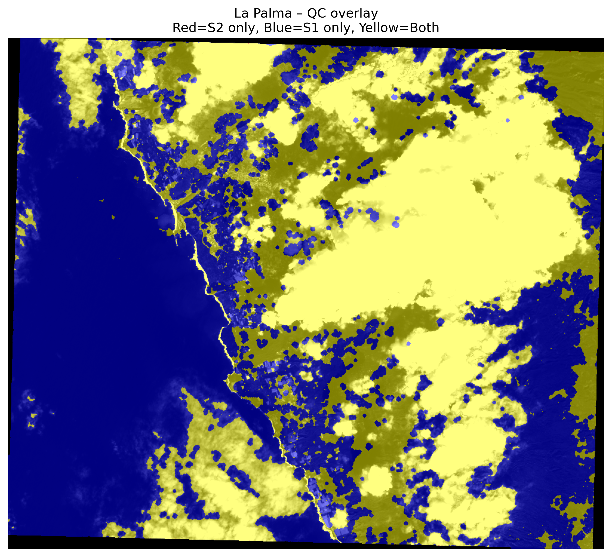

# La Palma 2021 Volcanic Eruption - Multi-Sensor Change Detection Analysis

**Remote Sensing & Disaster Monitoring Project** - Comprehensive pre/post-eruption change detection using Sentinel-1 SAR backscatter and Sentinel-2 optical imagery to map volcanic impact within exclusion zone.

## 🎯 Project Objective

This project analyzes the 2021 La Palma volcanic eruption (Cumbre Vieja volcano) through multi-temporal change detection, comparing pre-eruption (Sep 1, 2021) and post-eruption (Dec 15, 2021) satellite imagery. The analysis combines **Sentinel-1 SAR** (VV polarization, insensitive to clouds/lava glow) with **Sentinel-2 optical** (B04 red band) data to:

- Map **lava flow extent** and **vegetation destruction**
- Detect **structural changes** in built-up areas
- Perform **temporal backscatter analysis** for eruption progression
- Validate results through **quality control overlays** and **sensor fusion** (SAR-AND-Optical, SAR-OR-Optical)
- Generate **actionable insights** for disaster response within the official exclusion zone (GeoJSON-defined ROI)

**Key Challenge**: Cloud cover post-eruption required SAR integration with optical validation.

## 📊 Data Sources
| Sensor | Pre-Eruption | Post-Eruption | Resolution | Purpose |
|--------|--------------|---------------|------------|---------|
| **Sentinel-1 SAR** | 2021-09-01 VV | 2021-12-15 VV | 20m | Cloud-penetrating change detection |
| **Sentinel-2 Optical** | 2021-09-01 B04 | 2021-12-15 B04 | 20m | Vegetation/land cover validation |

## 🔬 Analysis Pipeline
1. ROI Clipping (GeoJSON) → 2. Calibration → 3. Co-registration
→ 4. Change Difference → 5. Thresholding → 6. SAR/Optical Fusion
→ 7. Temporal Trends → 8. QC Validation

## 📈 Visualization Results

### Quality Control Overlay

*Pre/post data alignment and preprocessing validation*

### Binary Change Detection Map

*Lava flow and structural change mask (white = change detected)*

### Temporal Backscatter Analysis

*VV backscatter evolution showing eruption progression*

### Multi-Sensor Quality Metrics

*SAR vs Optical agreement analysis*

## 📁 Repository Structure
LaPalma_Project/
├── data/ # LaPalma_ROI.geojson, .wkt
├── notebooks/ # La Palma_V2.html (full pipeline)
├── output/ # Processed GeoTIFFs + PNG visualizations
├── reports/ # LaPalma_Analysis_Report.pdf, Quick_Summary.md
└── requirements.txt # Python environment

## 🚀 Quick Start
pip install -r requirements.txt

Open interactive notebook
jupyter notebook notebooks/La Palma_V2.html

## 📄 Deliverables
- [Complete Technical Report](reports/LaPalma_Analysis_Report.pdf)
- [Executive Summary](reports/LaPalma_Quick_Summary.md)

**Tech Stack**: Jupyter, GDAL, Rasterio, GeoPandas, Matplotlib  
**Status**: Production-ready analysis with full QC validation
